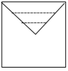

# Тема: Работа с массивами. Двухмерные массивы

**Задание:**

Дана действительная квадратная матрица порядка n. Найти наибольшее из значений элементов, расположенных в заштрихованной
части матрицы.

